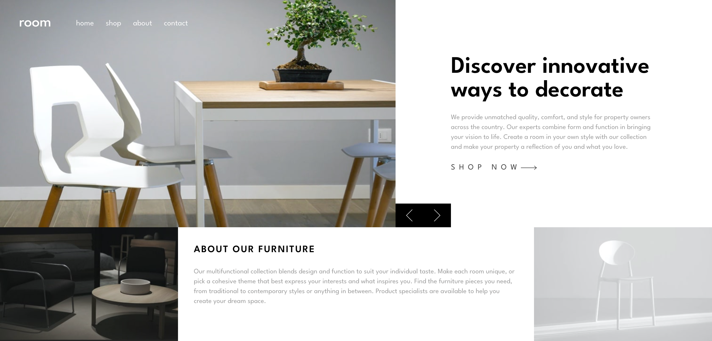

# Modern Furniture Store Website 🛋️

A modern and minimalist furniture store website built using **React, Tailwind CSS.**. The site features a sleek design, responsive layout, and smooth user experience.

## ✨ Features

- 🦾 Fully responsive UI
- 🧵 Modern and minimalist design
- 🍂 Smooth navigation and animations

## 🛠 Tech Stack

- **React** - Component-based UI
- **Tailwind CSS** - Utility-first styling
- **Vite** - Fast development environment

## 📸 Preview



## 📦 Installation

To run this project locally, follow these steps:

1. Clone the repository:

```sh
    git clone https://github.com/Stevesadr/Roomhomepage.git
```

2. Navigate to the project folder:

```sh
    cd room
```

3. Install dependencies:

```sh
    npm install
```

4. Start the development server:

```sh
   npm run dev
```

## 🌍 Live Demo

## 🙌 Acknowledgments

This project is based on a challenge from [Frontend Mentor](https://www.frontendmentor.io/).  
The original design idea belongs to them, and I have built it using React and Tailwind CSS.

# 🌟 Show Your Support!

If you like this project, please ⭐️ the repository to help it grow!
